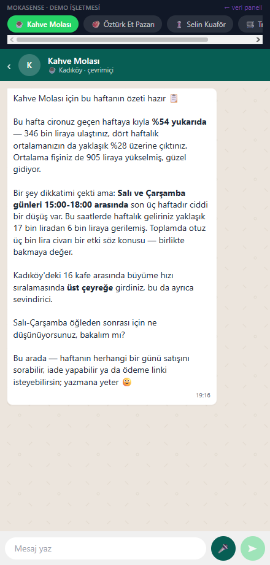
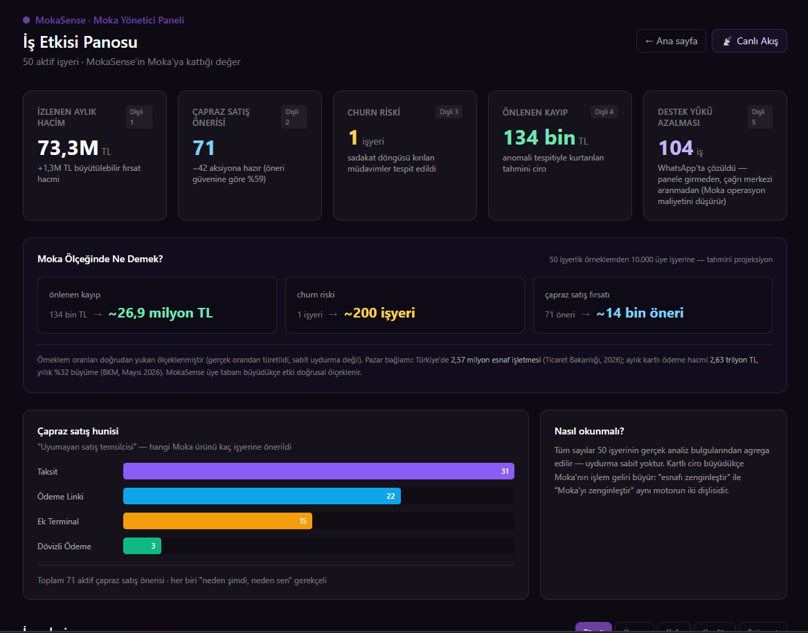
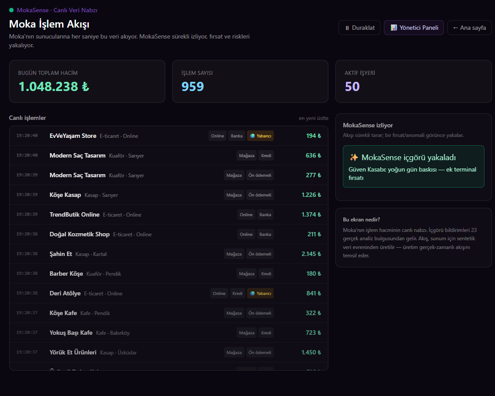
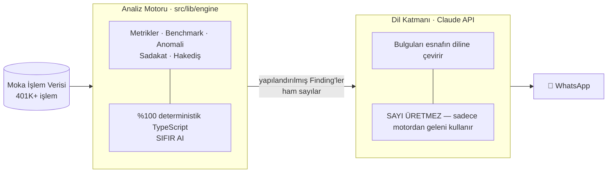

# MokaSense

> ### "Bizim POS para saymakla kalmaz, para kazandırır."

**Moka'nın sunucularında zaten duran ödeme verisini yapay zekâyla yorumlayıp, üye işyerlerine (esnaf/KOBİ) WhatsApp üzerinden içgörü, semt kıyası ve tek-tuş aksiyon sunan asistan.**

Moka United FinTech Hackathon · "Hack the Idea" 2026 · Ekip **Embar** — Baran Sayı, Emir Efe Güzel

---

## Problem → Çözüm

**Problem.** Moka'nın mevcut paneli "ne oldu?" sorusunu cevaplar (işlem listesi, Excel dökümü). "Bu ne anlama geliyor, ne yapmalıyım?" sorusunu cevaplayan katman yoktur. Esnaf (kasap, kafeci, kuaför) dashboard açmaz, Excel okumaz.

**Çözüm.** Esnaf WhatsApp'ı hiç bırakmaz. MokaSense, Moka'nın verisini **esnafın diline** çevirir: haftalık özet, "semtindeki benzer esnafla nasıl gidiyorsun" kıyası, kaybolan müdavim uyarısı, ciro düşüşü tespiti — ve panelden yapılan işleri (rapor, iade, hakediş, ödeme linki) sohbette **tek tuşla** yaptırma.

---

## Ekran Görüntüleri

| Esnaf Deneyimi (`/chat`) | Yönetici Paneli (`/admin`) | Canlı Akış (`/live`) |
|:---:|:---:|:---:|
|  |  |  |
| WhatsApp asistanı, sesli + yazılı | 5 dişli iş etkisi + Moka ölçeği | Gerçek zamanlı işlem nabzı |

> **Demo videosu:** https://docs.google.com/videos/d/1DAQTICxkckMFKlgmnli6NN1KvfPjOVdbXE7wOHxVYjc/edit?usp=sharing
>
> **Sunum:** https://docs.google.com/presentation/d/1cHnhxzo72pk-q7buEnjF9NHn3E5hGhzo/edit?usp=sharing

---

## Zeka Mimarisi — İki Katman Ayrık

Bu ayrım MokaSense'in temel teknik iddiasıdır ve "AI yerindeliği" sorusunun cevabıdır.



**ASCII özet:**

```
Moka verisi ──▶ [ANALİZ MOTORU]  ──Finding──▶ [DİL KATMANI]  ──▶ WhatsApp
                 deterministik,                 Claude API,
                 tüm sayılar burada             sadece çevirir, sayı üretmez
```

- **Analiz Motoru** (`src/lib/engine/`) — Tüm metrikler, benchmark, anomali, sadakat döngüsü ve hakediş hesabı **%100 deterministik TypeScript** ile burada yapılır. Sıfır AI. Çıktısı yapılandırılmış `Finding` nesneleridir.
- **Dil Katmanı** (Claude API) — Motorun bulgularını samimi esnaf Türkçesine çevirir. Sistem promptunda **"sana verilen sayılar dışında sayı üretme"** kısıtı açıkça dayatılır.

> ### "Sayılar asla halüsinasyon görmez; AI sadece tercüman ve iletişimcidir."

### Aksiyon Güvenliği — para hareketi AI'ya bırakılmaz

Soru mu, komut mu? Ayrım **deterministik kodda** (`src/lib/language/intent.ts`) yapılır, AI'nın kararına bırakılmaz:

- _"iade nasıl çalışıyor"_, _"ne iadesi"_ → **bilgi** → sadece açıklanır, **buton çıkmaz**.
- _"son işlemi iade et"_ → **komut** → onay butonu çıkar; iade motordan bulunan gerçek son işleme bağlanır.
- Belirsiz/rica kipli iade → **buton çıkmaz**, önce netleştirilir.

Böylece bir bilgi sorusu yanlışlıkla müşterinin parasını iade edemez. Bu kural 5 birim testiyle kilitlidir.

---

## Özellikler

| Grup | Neler yapar |
|---|---|
| 🔍 **İşini Anla** | Semt/sektör kıyası (ciro büyümesi, ort. fiş, sadakat), müşteri sadakati & kaybolan müdavimler, düşüş/anomali tespiti, en yoğun gün-saat, turist/yabancı kart sinyali |
| 📊 **Satış & Rapor** | Günlük/haftalık döküm, trend, ay sonu nakit akışı tahmini |
| 🔄 **İşlem & İade** | Son işleme bağlı iade, ret/hata analizi |
| 💰 **Para & Muhasebe** | Hakediş ("yarın net ne yatacak"), ay sonu muhasebe özeti |
| 🔗 **Tahsilat & Ayarlar** | Ödeme linki, kampanya linki, taksit, dövizli ödeme, ek terminal |
| 🛠️ **Destek** | Teknik sorun tespiti → destek kaydı (çağrı merkezine gerek yok) |

Üç ekran: **`/chat`** (esnaf deneyimi) · **`/admin`** (Moka yönetici paneli, iş etkisi) · **`/live`** (canlı işlem akışı).

---

## Kurulum (5 dakikada ayağa kalkar)

```bash
# 1) Klonla ve bağımlılıkları kur
git clone <repo-url>
cd mokasense
npm install

# 2) Ortam değişkenlerini ayarla
cp .env.example .env.local
#    .env.local içine Anthropic API anahtarını yaz:
#    ANTHROPIC_API_KEY=sk-ant-...
#    Anahtarı buradan al: https://console.anthropic.com  (Settings → API Keys)
#    MOKA_MODE=mock  (varsayılan; canlı sunucuya gitmez, demo için yeterli)

# 3) Sentetik veriyi üret ve analiz et
npm run datagen   # 50 işyeri, 401K+ işlem → src/data/
npm run analyze   # motoru çalıştırır → src/data/insights/

# 4) Çalıştır
npm run dev       # http://localhost:3000
```

Aç: **http://localhost:3000** → oradan `/chat`, `/admin`, `/live` ekranlarına geç.

> `ANTHROPIC_API_KEY` yalnızca `/chat` ekranındaki dil katmanı için gerekir. `/admin` ve `/live` anahtar olmadan da çalışır (tüm sayılar deterministik motordan gelir).

---

## Moka Entegrasyonu

Aksiyon katmanı, Moka'nın gerçek **"Ödeme İsteği Gönderme"** API şemasıyla yazılmıştır (`CommunicationType=3`, `CheckKey` SHA-256 formülü dahil — `src/lib/moka/`).

- **`MOKA_MODE=mock` (varsayılan):** Canlı sunucuya gitmez; gerçek şema formatında istek üretir, gerçekçi başarı yanıtı ve tıklanabilir demo ödeme linki (`/pay/[id]`) döner. Yanıtlar açıkça "demo · test modu" etiketlidir.
- **`MOKA_MODE=live`:** `service.mokaunited.com`'a gerçek POST atar. Kod hazır; tek env değişikliğiyle aktifleşir.

**Sahte para hareketi yoktur.** Mock modda hiçbir yanıt "gerçek para hareket etti" iddiasında bulunmaz.

---

## Veri Notu (dürüstlük)

Demo, **sentetik ama gerçekçi** veri kullanır: 50 işyeri (12 kasap, 16 kafe, 10 kuaför, 12 e-ticaret), **401K+ işlem**, deterministik sabit seed. Sektörel saat desenleri, lognormal sepet dağılımı, maaş günü etkisi, kalıcı kart-token'lı sadık müşteri havuzları ve planlı demo anomalileri (kahraman kafe çukuru, red patlaması, iade anomalisi, kayıp müdavimler, yabancı kart trendi) içerir.

Motor **veri-bağımsızdır**: aynı `Transaction` şemasını okur. Gerçek Moka verisine bağlamak bir konfigürasyon işidir; iş mantığı değişmez.

---

## Testler

```bash
npm run test:engine     # 16 test — metrikler, benchmark, sadakat döngüsü, anomali eşiği
npm run test:moka       # 39 test — aksiyon katmanı + niyet çözücü (iade güvenlik ayrımı dahil)
npm run test:pipeline   # 10 test — uçtan uca motor→dil hattı
npm run test:lang       # canlı Dil Katmanı çıktı denetimi (ANTHROPIC_API_KEY gerektirir)
```

**65 deterministik test** (engine + moka + pipeline) API anahtarı olmadan çalışır ve geçer.

---

## Teknoloji

**Next.js 14** (App Router) · **TypeScript** (strict) · **Tailwind CSS** · **Claude API** (`@anthropic-ai/sdk`) · **tsx**

## Dizin Yapısı

```
src/
  app/
    chat/         → WhatsApp-görünümlü esnaf sohbeti (sesli + yazılı)
    admin/        → Moka yönetici paneli (5 dişli iş etkisi, Moka ölçeği projeksiyonu)
    live/         → canlı işlem akışı (sahne ekranı)
    dev/          → sentetik veri sağlık paneli (geliştirici görünümü)
    api/          → chat (streaming) + action (Moka aksiyonları)
  lib/
    datagen/      → sentetik veri üreteci (deterministik seed)
    engine/       → ANALİZ MOTORU — tüm sayılar burada, sıfır AI
    language/     → DİL KATMANI — Claude promptları, niyet çözücü, sesli giriş
    moka/         → Moka API istemcisi (gerçek şema, mock/live mod)
    admin/        → yönetici paneli agregasyonu
  data/           → üretilen JSON çıktılar (git dışı — datagen/analyze ile üretilir)
```
